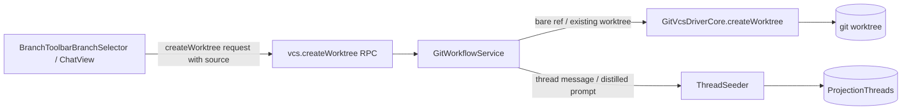
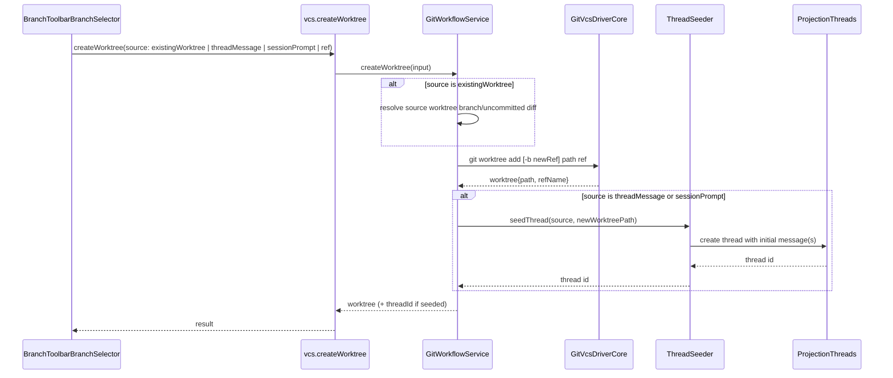

## 1. Context

Worktree creation today (`packages/contracts/src/git.ts` `VcsCreateWorktreeInput`, `apps/server/src/vcs/GitVcsDriverCore.ts` `createWorktree`, `apps/server/src/git/GitWorkflowService.ts`, RPC handler in `apps/server/src/ws.ts`) accepts only a bare `refName` (+ optional `newRefName`/`baseRefName`/`path`) and runs `git worktree add`. There is no concept of seeding a worktree from another worktree's live state, from a thread message, or from a distilled prior-session prompt. Threads are persisted via `apps/server/src/persistence/Layers/ProjectionThreads.ts`; per-provider adapters (`ClaudeAdapter.ts`, `CodexSessionRuntime.ts`, etc.) support resuming a session in place but have no fork/duplicate primitive. The UI surface for worktree creation is `apps/web/src/components/BranchToolbarBranchSelector.tsx` and the auto-worktree path in `ChatView.tsx`.

Relevant spec: `specs/worktree-branching/spec.md` (this change).

## 2. Goals / Non-Goals

**Goals:**
- Let a worktree-creation request declare one of four sources: bare ref, existing worktree, thread message, or distilled session prompt.
- Reuse the existing `git worktree add` mechanics for the actual worktree creation; only the *seeding* step is new.
- Seed the new thread's initial context deterministically from the chosen source.

**Non-Goals:**
- No change to how worktrees are removed or how existing bare-ref creation behaves.
- No cross-repository branching (source and target worktrees remain within the same repo).
- The "distillation" of a clean prompt is a single best-effort LLM summarization step, not a configurable pipeline.

## 3. Architecture

| Subsystem | Responsibility | Owns (data / contract) |
| --------- | -------------- | ---------------------- |
| `GitWorkflowService` | Resolves the requested source into concrete git operands (ref, path, working-tree copy) before delegating to core | Source-resolution logic |
| `GitVcsDriverCore` | Executes `git worktree add` and related plumbing | Worktree filesystem state |
| `ThreadSeeder` (new, server-side) | Builds the initial message set for the new thread from a source message or distills a prompt from a prior session | Initial thread content |
| `ProjectionThreads` | Persists threads/messages | Thread/message records |

## 4. Components and Runtime Flows

For "include uncommitted changes" from an existing worktree, `GitWorkflowService` copies the working-tree diff (via `git diff` + apply, or a filesystem copy of tracked+untracked changes) into the new worktree after `git worktree add` completes, rather than teaching `GitVcsDriverCore` a new git primitive.

## 5. Data Model

| Entity / record | Owner | Store and format | Lifecycle / invariants |
| --------------- | ----- | ---------------- | ----------------------- |
| `VcsCreateWorktreeInput.source` | `packages/contracts/src/git.ts` | RPC/IPC request payload (in-memory, wire JSON) | Exactly one of `{ ref }`, `{ existingWorktreePath, includeUncommitted }`, `{ threadId, messageId }`, `{ sessionThreadId }` must be set |
| Seeded thread | `ProjectionThreads` | Existing thread/message persistence layer | Created atomically with the worktree; if worktree creation fails, no thread is created; if seeding fails after worktree creation, the worktree is retained and the error surfaces separately (no orphaned partial thread) |

## 6. Interfaces and Contracts

| Interface | Purpose | Input | Output / errors | Compatibility |
| --------- | ------- | ----- | ---------------- | ------------- |
| `vcs.createWorktree` RPC (`apps/server/src/ws.ts`, `packages/contracts/src/rpc.ts`) | Create a worktree from any of the four sources | `VcsCreateWorktreeInput` extended with `source` (see Data Model) | `VcsCreateWorktreeResult` extended with optional `threadId`; validation error if `source` missing/ambiguous; not-found error if source worktree/message/session no longer exists | Additive — existing callers passing only `refName` continue to work unchanged (`source` defaults to `{ ref: refName }`) |

## 7. Security and Trust Boundaries

No new trust boundary: all sources (existing worktree, thread message, session) must belong to a repo/project the requesting session already has access to. The server SHALL re-validate that the source worktree/thread/session is owned by the same project as the request before seeding, rather than trusting client-supplied IDs.

## 8. Failure Modes and Resilience

| Failure | Expected behavior | Mitigation / recovery | Blast radius |
| ------- | ----------------- | ---------------------- | ------------ |
| Source worktree removed before request completes | Request rejected, no worktree created | Re-check existence at request time | Single request |
| Uncommitted-changes copy fails mid-way (disk error, conflicting paths) | Worktree creation rolled back (remove partially-created worktree) | Wrap in try/cleanup around `git worktree add` | Single request |
| Prompt distillation (LLM call) fails or times out | Worktree not created; error surfaced to user | Fail closed rather than creating an empty/unseeded thread | Single request |
| Thread seeding fails after worktree already created | Worktree kept, error reported distinctly from worktree-creation failure so user isn't left thinking nothing happened | Return partial result with `threadId: null` and an error field | Single request |

## 9. Decisions, Risks, and Trade-offs

### Decision: Reuse `git worktree add` for all sources; only seeding differs
Keeps `GitVcsDriverCore` unchanged for the git-plumbing path, minimizing risk to the existing, well-exercised bare-ref creation flow. New logic is isolated in `GitWorkflowService` (source resolution) and a new `ThreadSeeder` (content seeding). Rejected alternative: teaching `GitVcsDriverCore` about threads/messages directly, which would couple git plumbing to persistence concerns.

### Decision: Distillation is a single best-effort LLM call, fail-closed
Simpler than a configurable summarization pipeline; matches the proposal's "clean prompt" framing. Risk: distillation quality varies. Mitigation: user can edit the distilled prompt before the new thread starts running (UI concern, not server concern).

### Risks
- [Copying uncommitted changes could silently drop untracked files outside git's diff mechanism] → Mitigation: explicitly enumerate untracked files via `git status --porcelain` and copy them alongside the applied diff, and surface a warning if any file fails to copy.
- [Concurrent modification of the source worktree while branching] → Mitigation: snapshot the diff/branch tip at request start; no locking needed since this is best-effort seeding, not a transactional merge.

## 10. Migration and Rollback

Not applicable — additive contract change (`source` optional, defaults to today's ref-only behavior) and new server-side code paths; no data migration required. Rollback is a plain revert of the change.

## 11. Open Questions

None — resolved during design.
