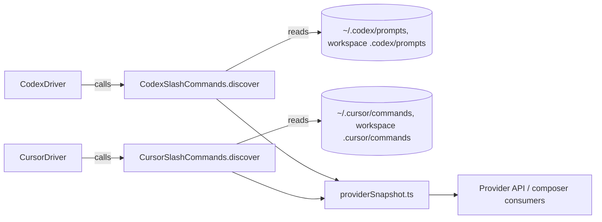
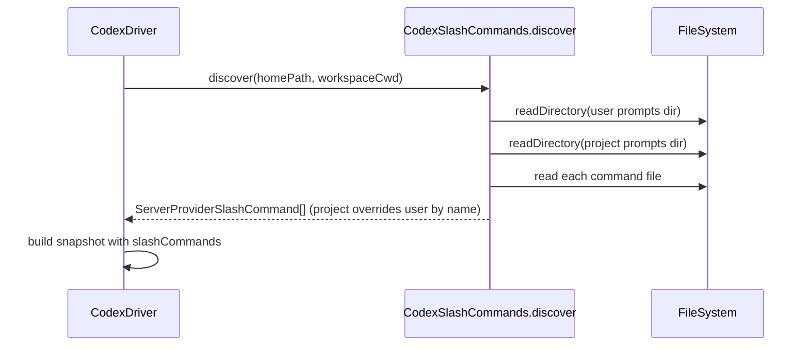

## 1. Context

T3 Code drives multiple external coding-agent CLIs/SDKs through per-provider drivers under `apps/server/src/provider/Drivers/`. Each provider snapshot exposes `slashCommands: Array<ServerProviderSlashCommand>` (`packages/contracts/src/server.ts`), consumed generically by the web composer (`ComposerCommandMenu.tsx`, `composerSlashCommandSearch.ts`) and mobile (`ThreadComposer.tsx`). Only Claude populates this today, via the Agent SDK's init handshake (`ClaudeProvider.ts`) — not filesystem discovery. `ClaudeSkills.ts` already establishes the pattern this change reuses for *skills*: scan a resolved home directory plus the workspace's `.claude/skills`, parse frontmatter, project scope wins on collision. Home-directory resolution per provider already exists (`ClaudeHome.ts::resolveClaudeHomePath`, `CodexHomeLayout.ts::resolveCodexHomeLayout`); this change adds command-directory discovery on top of those, plus an equivalent for Cursor (which has no existing home-resolution helper).

Relevant spec: `specs/provider-slash-commands/spec.md` (new).

## 2. Goals / Non-Goals

**Goals:**
- Populate `slashCommands` for Codex and Cursor drivers from their local harness config directories.
- Reuse the existing scan/parse/merge shape from `ClaudeSkills.ts` (user scope + project scope, project wins) so the code reads the same way across drivers.
- Fail soft: a missing directory or malformed file must not break provider snapshot construction.

**Non-Goals:**
- No change to how Claude's `slashCommands` are sourced (Agent SDK handshake stays authoritative for Claude).
- No new UI work — `slashCommands` consumers already iterate the list generically.
- Grok and OpenCode are out of scope for this change; they have no documented local command-file convention today. Add them later if one emerges.

## 3. Architecture

| Subsystem | Responsibility | Owns (data / contract) |
| --------- | -------------- | ---------------------- |
| `CodexSlashCommands.ts` (new) | Discover + parse Codex prompt files into `ServerProviderSlashCommand[]` | Codex command directory scan logic |
| `CursorSlashCommands.ts` (new) | Discover + parse Cursor command files into `ServerProviderSlashCommand[]` | Cursor command directory scan logic |
| `CodexDriver.ts` / `CursorDriver.ts` | Call discovery during snapshot build, pass result into `providerSnapshot.ts` | Driver-level orchestration |
| `providerSnapshot.ts` | Assemble the `ServerProvider` object | Snapshot shape (unchanged) |

## 4. Components and Runtime Flows

Discovery runs synchronously as part of each driver's existing status/snapshot Effect pipeline (the same place `discoverClaudeSkills` is invoked for skills) — no new triggering event.

Per-file parse mirrors `ClaudeSkills.ts`'s `FRONTMATTER_PATTERN`: optional YAML frontmatter (`name`, `description`, `argument-hint` or similar) followed by a markdown body; filename (without extension) is the fallback name.

## 5. Data Model

| Entity / record | Owner | Store and format | Lifecycle / invariants |
| --------------- | ----- | ---------------- | ---------------------- |
| Codex prompt command | `CodexSlashCommands.ts` | `<codex home>/prompts/*.md` and `<cwd>/.codex/prompts/*.md` on disk, Markdown + optional YAML frontmatter | Read-only scan per snapshot build; no caching beyond existing driver caching |
| Cursor command | `CursorSlashCommands.ts` | `~/.cursor/commands/*.md` and `<cwd>/.cursor/commands/*.md` on disk, Markdown + optional YAML frontmatter | Same as above |
| `ServerProviderSlashCommand` | `packages/contracts/src/server.ts` | In-memory, serialized in provider snapshot API response | Existing shape, reused unchanged |

## 6. Interfaces and Contracts

No new external interfaces. `slashCommands` on `ServerProvider` is an existing contract field; this change only adds population for two more provider kinds. Internal discovery functions follow the existing `discoverClaudeSkills(configDir, workspaceCwd): Effect<...>` signature shape for consistency.

## 7. Security and Trust Boundaries

Discovery only reads local files the user already controls (their own home directory and workspace) — same trust level as existing skill discovery. No new secrets or network calls introduced. Malformed or oversized command files must not crash the server; parse errors are skipped per-file, consistent with `ClaudeSkills.ts` behavior.

## 8. Failure Modes and Resilience

| Failure | Expected behavior | Mitigation / recovery | Blast radius |
| ------- | ----------------- | --------------------- | ------------ |
| Command directory does not exist | Treated as zero commands from that scope | Directory-not-found is not an error path | Single provider's `slashCommands` |
| Command file unreadable / malformed frontmatter | That file is skipped | Fallback to filename-as-name where possible, else skip | Single command entry |
| Directory contains very many files | Discovery may take longer per snapshot build | Reuse existing scan cadence/caching from driver status checks (no new polling) | Snapshot build latency for that provider only |

## 9. Decisions, Risks, and Trade-offs

### Decision: Mirror `ClaudeSkills.ts`'s scan/merge pattern instead of a shared generic discovery module

Reuses a pattern already reviewed and tested in this codebase, keeping each provider's directory conventions and frontmatter dialect explicit and independently adjustable. A shared generic module was considered but rejected: Codex and Cursor's file conventions are not yet proven similar enough to abstract without adding indirection for two call sites.

### Risks

- [Codex/Cursor command file format may differ from assumed frontmatter shape] → Verify actual on-disk format for each harness against real installed configs (e.g. `~/.codex/prompts`, `~/.cursor/commands`) before finalizing parse logic in tasks; adjust the parser to match reality rather than the assumed shape.
- [Cursor has no existing home-resolution helper like `ClaudeHome.ts`/`CodexHomeLayout.ts`] → Add a minimal Cursor home-path resolver scoped to this change rather than a full settings subsystem.

## 10. Migration and Rollback

Not applicable — additive, backward-compatible change. No data migration; rollback is a straight revert of the new discovery modules and their driver wiring, since `slashCommands` simply reverts to `[]` for these providers.

## 11. Open Questions

- Exact on-disk directory name and frontmatter fields Codex uses for reusable prompts (`~/.codex/prompts` assumed) — confirm against a real Codex CLI install before implementing the parser. Owner: implementer, resolve during task 1.
