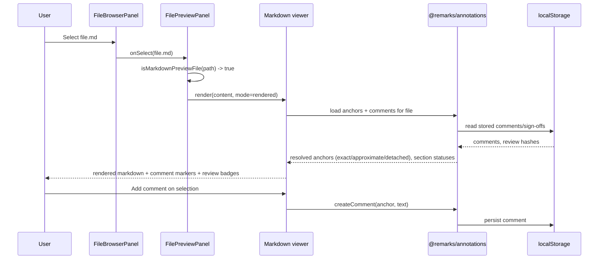

## 1. Context

`apps/web/src/components/files/FilePreviewPanel.tsx` currently previews all file types: code via `@pierre/diffs` (`VirtualizedFile`/`Editor`/`File`/`Virtualizer`), images via `isWorkspaceImagePreviewPath` (`@t3tools/shared/filePreview`), and markdown via `ChatMarkdown` with a raw/rendered toggle driven by `filePreviewMode.ts` (`isMarkdownPreviewFile`, `setMarkdownTaskChecked`). Commenting today is `LocalCommentAnnotation.tsx`, a local, non-persisted annotation stand-in, plus `buildFileReviewComment` in `~/reviewCommentContext`.

`~/workplace/remarks` is a separate, unpublished monorepo providing a layered annotatable-markdown stack: `@remarks/anchor` (pure anchoring model), `@remarks/renderer` (React renderer), `@remarks/store` + `@remarks/store-local` (comment storage interface + localStorage impl), `@remarks/review` (hash-based section sign-off), and `@remarks/annotations` (integrates anchor+store+review+renderer+diff). Per its README, migration of external consumers is "proposed per-repo once the packages publish" — they are not yet on a registry and it is not part of t3code's pnpm workspace, so this change vendors their current source into t3code rather than depending on the sibling checkout (see Decisions, section 9).

This design covers `markdown-file-preview` (spec) and `markdown-review-surface` (spec), both scoped to `apps/web`.

## 2. Goals / Non-Goals

**Goals:**
- Render markdown files in the file browser using `@remarks/renderer` instead of `ChatMarkdown`, preserving the existing raw/rendered toggle.
- Add anchored commenting and section review status for markdown files using `@remarks/annotations` (anchor + store-local + review), replacing `LocalCommentAnnotation` for markdown files only.
- Keep all other file preview behavior (code, images) unchanged.

**Non-Goals:**
- Publishing `@remarks/*` to a package registry (tracked in the `remarks` repo, not here).
- Cross-session/cross-device comment sync — this change uses `@remarks/store-local` (browser localStorage), matching the current local-only nature of `LocalCommentAnnotation`.
- Editing markdown content inline through the rendered view (view stays read-only; raw source editing, if any, is out of scope).
- Migrating non-markdown files or `ChatMarkdown`'s use in chat itself.

## 3. Architecture

```mermaid
flowchart LR
  user([User]) --> browser[FileBrowserPanel]
  browser --> preview[FilePreviewPanel]
  preview -->|.md/.mdx| mdview[Markdown viewer\n(@remarks/renderer + @remarks/anchor)]
  preview -->|other| existing[Existing code/image preview\n(@pierre/diffs, isWorkspaceImagePreviewPath)]
  mdview --> annotations[@remarks/annotations\n(anchor + review)]
  annotations --> store[(@remarks/store-local\nlocalStorage)]
```

| Subsystem | Responsibility | Owns (data / contract) |
| --------- | -------------- | ---------------------- |
| FilePreviewPanel | Chooses preview mode per file type, hosts raw/rendered toggle | Preview mode state (`filePreviewMode.ts`) |
| Markdown viewer (`@remarks/renderer`) | Renders markdown to read-only HTML-equivalent output | None (pure render of given content) |
| `@remarks/annotations` | Anchors comments to text, derives section review status | Anchor resolution, review-hash comparison logic |
| `@remarks/store-local` | Persists comments and sign-off records | Browser localStorage, keyed per file |

## 4. Components and Runtime Flows



Raw-source mode bypasses `MV`/`AN` entirely and shows the existing plain-text view, matching current `filePreviewMode.ts` behavior.

## 5. Data Model

| Entity / record | Owner | Store and format | Lifecycle / invariants |
| --------------- | ----- | ---------------- | ---------------------- |
| Comment | `@remarks/store-local` | Browser localStorage, JSON, keyed by file identity | Created by user action; persists until deleted; anchor re-resolved on each load against current content |
| Sign-off record | `@remarks/review` (via `@remarks/store-local`) | Browser localStorage, JSON | Stores approved section content hash; status derived (not stored) by comparing to current section hash on each load |

File content itself is unchanged — read from the existing file-content source used by `FilePreviewPanel` today; no new file storage is introduced.

## 6. Interfaces and Contracts

| Interface | Purpose | Input | Output / errors | Compatibility |
| --------- | ------- | ----- | --------------- | ------------- |
| `FilePreviewPanel` markdown branch | Route `.md`/`.mdx` files to the new viewer | File path, raw content, preview mode | Rendered React tree or raw text | Additive — non-markdown branch untouched |
| `@remarks/annotations` file-scoped API | Load/create comments, compute review status | File identity, raw markdown content | Anchored comment list, per-section status | Internal (package) contract, owned by `remarks` repo |

No HTTP/RPC surface changes — this is entirely client-side within `apps/web`.

## 7. Security and Trust Boundaries

Not applicable in a meaningful new sense: comments and sign-offs are stored in browser localStorage, matching the trust level of the existing `LocalCommentAnnotation` (local-only, no server persistence, no new auth boundary). No secrets are introduced. Markdown content is rendered client-side; `@remarks/renderer` output must not execute arbitrary HTML/script from file content — confirm the renderer sanitizes or does not support raw HTML pass-through equivalent to `ChatMarkdown`'s current handling, since file content is less trusted than chat content.

## 8. Failure Modes and Resilience

| Failure | Expected behavior | Mitigation / recovery | Blast radius |
| ------- | ----------------- | --------------------- | ------------ |
| Vendored `@remarks/*` package fails to build/typecheck | Build fails at compile time, not runtime | Caught by normal CI/build, same as any other in-repo package | Whole `apps/web` build, until fixed |
| Anchor cannot be resolved (text removed) | Comment shown as detached, not lost or mis-attached | `@remarks/anchor` explicitly supports a `detached` state | Single comment, single file |
| localStorage unavailable/full | Comment/sign-off creation fails silently or with a visible error | Surface a UI error on write failure; reading falls back to no comments | Single file's comments for that browser |

## 9. Decisions, Risks, and Trade-offs

### Decision: Vendor the needed `@remarks/*` source into t3code rather than depend on the sibling checkout

`~/workplace/remarks` is a fully separate pnpm workspace, not part of t3code's `pnpm-workspace.yaml`, and its packages are unpublished. A `file:`/path dependency into that sibling checkout would make `apps/web`'s build depend on an out-of-repo path that doesn't exist in CI or on other machines. To unblock this change now without that fragility, the current source of `@remarks/anchor`, `@remarks/renderer`, `@remarks/annotations`, `@remarks/review`, and `@remarks/store-local` is copied into a new t3code-owned location (e.g. `packages/remarks-*` or a single `packages/markdown-review` package) and added to `pnpm-workspace.yaml`'s existing `packages/*` glob, so no new workspace entry or cross-repo path is needed.
Cost: t3code now owns and maintains this code directly; it will not automatically pick up future fixes or features from the `remarks` repo, and the two copies can diverge. If `remarks` publishes packages later, this vendored copy should be replaced with a real dependency.
Rejected alternative: `file:` path dependency into `~/workplace/remarks` — rejected as too fragile for CI/other machines. `pnpm link` — rejected as dev-only, no committed dependency. Waiting for publication — rejected as blocking this change indefinitely.

### Decision: Use `@remarks/store-local` (localStorage) rather than a new server-backed store

Matches the current local-only, non-persisted nature of `LocalCommentAnnotation` — no existing server API for file comments exists to extend. Keeps this change's blast radius client-side only.
Cost: comments do not sync across devices/sessions or team members, limiting "review surface" usefulness for real collaborative review.
Rejected alternative: build a server-backed `@remarks/store` implementation now — rejected as out of scope; `@remarks/store`'s interface is designed to support this later without changing the anchor/review model.

### Risks

- [Vendored `@remarks/*` copy silently diverges from the upstream `remarks` repo over time] → Mitigation: note the vendored packages' origin/commit in a README within the vendored location; revisit replacing the vendor with a real dependency once `remarks` publishes.
- [`@remarks/renderer` output differs visually/behaviorally from `ChatMarkdown` for edge-case markdown (e.g. embedded HTML, custom syntax) already relied on by users] → Mitigation: manual comparison pass over representative markdown files during implementation before removing `ChatMarkdown` usage in `FilePreviewPanel`.

## 10. Migration and Rollback

Atomic within `apps/web`: the markdown branch of `FilePreviewPanel` swaps renderer and comment component together. Rollback is reverting the `FilePreviewPanel.tsx` change and the vendored packages; no data migration is needed since existing `LocalCommentAnnotation` data (if any persisted) is separate from the new `@remarks/store-local` keys and is simply orphaned, not corrupted, on rollback.
