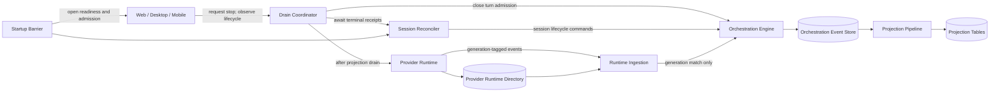
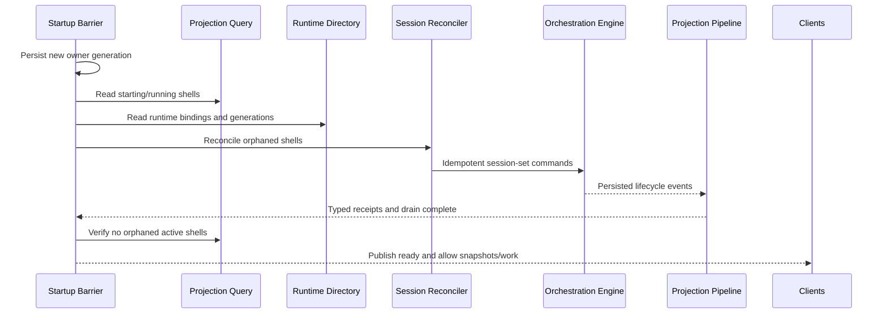

## 1. Context

T3 has two distinct persisted status layers. `projection_thread_sessions.status` is reconstructed from orchestration events and is the durable client-visible work lifecycle. `provider_session_runtime.status` is provider process/routing metadata and may legitimately disagree while a provider is alive but idle or has been reaped. Today, shutdown paths batch-stop provider runtime bindings without guaranteeing a terminal `thread.session-set`, while startup does not reconcile active-looking durable shells. Because projector cursors can be current while the latest event still says `running`, projector repair or direct projection writes would address the wrong layer.

The existing orchestration status set already distinguishes `interrupted` from `stopped`. Projector semantics settle an active turn as interrupted when its session becomes either `interrupted` or `stopped`; this design uses `interrupted` when active work is known or conservatively believed to have been lost, and `stopped` only when no active turn exists. It does not introduce another session status.

## 2. Goals / Non-Goals

**Goals:**

- Coordinate intentional stop/restart with turn admission and durable lifecycle completion.
- Guarantee stale `starting`/`running` shells converge before server readiness after graceful or crash-style restart.
- Fence provider lifecycle events by session incarnation.
- Preserve legitimate idle shell/runtime combinations.
- Keep live projection and replay equivalent and make every recovery step idempotent.
- Share authoritative drain progress across web, desktop, mobile, local, remote, and tunnel connections.

**Non-Goals:**

- Correct provider `turn.aborted` ingestion.
- Resume an interrupted turn automatically or provide exactly-once semantics for arbitrary provider tools.
- Restructure the projector or write projection tables outside normal event projection.
- Keep provider processes alive across server replacement.
- Modify or test against live T3 userdata.

## 3. Architecture



| Subsystem                  | Responsibility                                                                                    | Owns (data / contract)                                 |
| -------------------------- | ------------------------------------------------------------------------------------------------- | ------------------------------------------------------ |
| Drain Coordinator          | Serialize stop intent, close admission, report progress, and choose graceful or forced completion | Server drain record and lifecycle stream               |
| Session Reconciler         | Decide terminal lifecycle repairs for shutdown and startup                                        | Reconciliation commands and idempotency keys           |
| Orchestration Engine       | Persist canonical client-visible lifecycle facts                                                  | Orchestration events and typed receipts                |
| Projection Pipeline        | Derive shells and turn state only from events                                                     | Projection tables and projector cursor                 |
| Provider Runtime Directory | Route live sessions and identify ownership/incarnation                                            | Runtime bindings, owner generation, session generation |
| Runtime Ingestion          | Translate only current-generation provider events                                                 | Generation validation at adapter boundary              |
| Startup Barrier            | Prevent readiness, snapshots, and turn admission before repair completes                          | Activation ordering                                    |

## 4. Components and Runtime Flows

### Intentional drain and graceful shutdown

The Drain Coordinator writes the drain intent before broadcasting it, closes the turn-start admission gate, and derives outstanding work from durable session shells rather than browser-local state. Existing turns continue through provider events. A tool-call completion does not decrement the count; only a durable session transition away from `starting`/`running` does.

If all work completes, or the user explicitly forces shutdown, the Session Reconciler dispatches any remaining terminal transitions. For a shell with `activeTurnId`, it dispatches `interrupted`; without one, `stopped`. It awaits typed command receipts, drains provider-command/runtime-ingestion and projection workers, verifies no active-looking shell remains in scope, then allows provider `stopAll` and process shutdown. Runtime bindings are marked stopped after the durable transition is guaranteed.

```mermaid
sequenceDiagram
  participant C as Client
  participant D as Drain Coordinator
  participant O as Orchestration Engine
  participant P as Projection Pipeline
  participant R as Provider Runtime
  C->>D: Request restart
  D->>D: Persist drain; close turn admission
  D-->>C: Broadcast draining(count)
  R-->>O: Current-generation turn lifecycle events
  O-->>P: Persisted session events
  P-->>D: Typed receipts / worker drain
  alt all active turns completed
    D->>R: Stop all providers
  else force or drain expiry
    D->>O: Set remaining sessions interrupted/stopped
    O-->>P: Persisted terminal events
    P-->>D: Receipts and projection drain complete
    D->>R: Stop all providers
  end
  D->>D: Commit shutdown handoff
```

Pending approval or user-input turns remain active during an ordinary drain. The warning identifies blocked work. Cancellation reopens admission until provider shutdown begins. Force stop uses the same durable interruption path.

Drain expiry follows an entry-point policy rather than a shared implicit fallback:

| Entry point                                                                                                          | Deadline owner                                              | Outcome at expiry                                                                                                                       |
| -------------------------------------------------------------------------------------------------------------------- | ----------------------------------------------------------- | --------------------------------------------------------------------------------------------------------------------------------------- |
| Desktop update or authenticated server self-update request                                                           | Drain Coordinator using the update request's bounded policy | Remain in `action-required` drain state; do not update or restart until any authorized connected client cancels or forces               |
| Initiating interactive client disconnects                                                                            | Drain Coordinator                                           | Preserve `action-required`; another authorized client may decide, and disconnect alone neither cancels nor forces                       |
| Ordinary application quit that still has an interactive desktop shell                                                | Desktop shutdown controller                                 | Keep the application open in the shutdown warning until cancel or force; closing again is an explicit force action                      |
| OS signal, launcher replacement, service-manager stop, or application teardown with no viable interactive controller | Process/launcher shutdown budget                            | At the deadline, enter committing state, durably interrupt remaining active work, drain lifecycle workers, then stop providers and exit |

Only the final row automatically forces. Once committing begins, cancellation is rejected.

### Startup reconciliation

Each server process creates a new opaque `ownerGeneration` and durably records it before provider runtime hydration. Every newly started provider session creates an opaque `sessionGeneration`, persists it in its runtime binding, and supplies it to the adapter event envelope.

The Startup Barrier runs reconciliation after the event store and projection infrastructure are available but before HTTP/WebSocket readiness, initial shell snapshot publication, background session reaping, or provider turn admission. For each durable shell in `starting` or `running`, the binding is live only when it exists and its `ownerGeneration` equals the current process generation. A missing binding, a stopped binding, a pre-migration binding without ownership, or a binding owned by a previous process is orphaned even if its coarse status says `running`.

The reconciler emits a deterministic lifecycle command keyed by thread, observed session generation, and reconciliation reason. It selects `interrupted` when `activeTurnId` is present and `stopped` otherwise. It then waits for command receipts and projection drain. A second pass sees a non-active shell or an already completed idempotency key and performs no mutation.



### Generation-fenced event ingestion

Adapters attach `sessionGeneration` to every runtime event. A per-thread Provider Lifecycle Coordinator owns both generation installation and lifecycle mutation admission. Session replacement installs its generation through this coordinator. Runtime Ingestion submits the event and its proposed lifecycle command to the same coordinator, which checks the current generation and holds the thread lease until the orchestration command has reached its typed durable receipt. The lease does not wait for projection, so projection draining remains a separate barrier and unrelated threads remain concurrent.

This closes the check-then-dispatch race: an old event may read or queue before replacement, but it cannot both retain the lifecycle lease through durable mutation and allow replacement generation installation. Whichever operation acquires the lease first completes its authoritative mutation; the second re-evaluates against the resulting generation. Session startup may spawn a provider before binding is committed, but its events stay buffered behind generation installation and are discarded if startup never commits.

Shutdown reconciliation records an interruption disposition for the current session generation under the same lifecycle lease. A later matching-generation adapter exit is still accepted for runtime cleanup but its orchestration normalization is conditional: if that generation already has a shutdown-owned `interrupted` terminal disposition, the exit cannot downgrade it to `stopped`. An exit for an idle `ready` shell has no interruption disposition and continues to emit `stopped`.

For compatibility during rollout, an event without a generation is accepted only for a binding that also has no generation and only before a generated replacement is bound. Startup treats legacy active-looking bindings as unverifiable orphans. Once a generated binding exists, untagged and older-generation events cannot mutate it.

## 5. Data Model

| Entity / record             | Owner                          | Store and format                                                                        | Lifecycle / invariants                                                                                                              |
| --------------------------- | ------------------------------ | --------------------------------------------------------------------------------------- | ----------------------------------------------------------------------------------------------------------------------------------- |
| Drain record                | Drain Coordinator              | Existing persisted server runtime-state mechanism, encoded by a shared schema           | At most one active intent; phases are monotonic; startup clears a completed/abandoned prior-process drain only after reconciliation |
| Owner generation            | Startup Barrier                | Singleton server runtime metadata in SQLite or the existing atomic runtime-state record | Fresh opaque UUID per server process, persisted before runtime hydration                                                            |
| Provider session generation | Provider Runtime Directory     | Additive fields on `provider_session_runtime`, schema-decoded                           | Fresh opaque UUID per provider-session incarnation; immutable for that binding                                                      |
| Runtime event generation    | Provider adapter contract      | Additive field in the typed in-process event envelope                                   | Must remain current through durable lifecycle receipt under the per-thread lease                                                    |
| Terminal disposition        | Provider Lifecycle Coordinator | Generation-scoped runtime binding metadata                                              | `interrupted` is monotonic for shutdown-owned active work; cleared only when a new generation is installed                          |
| Durable session lifecycle   | Orchestration Engine           | `thread.session-set` events in the event store                                          | Canonical; never repaired by direct projection writes                                                                               |
| Client shell                | Projection Pipeline            | `projection_thread_sessions` SQLite projection                                          | Fully derivable from events; no generation-only repair writes                                                                       |

The projection session schema need not expose generations to clients. Reconciliation reads the durable shell plus runtime binding and performs its expected-generation check and durable orchestration dispatch while holding the Provider Lifecycle Coordinator's per-thread lease. The command carries the generation in metadata/idempotency correlation for audit and replay, but the coordinator—not a non-atomic projector precondition—is the authoritative concurrency boundary.

## 6. Interfaces and Contracts

| Interface                        | Purpose                                      | Input                                                                         | Output / errors                                                                               | Compatibility                                                                |
| -------------------------------- | -------------------------------------------- | ----------------------------------------------------------------------------- | --------------------------------------------------------------------------------------------- | ---------------------------------------------------------------------------- |
| Server stop/restart request      | Begin or control drain                       | action plus cancel/force intent                                               | Accepted drain snapshot; unauthorized, already-committing, or invalid-transition error        | Additive replacement/extension of current restart entry points               |
| Server lifecycle stream/snapshot | Render authoritative shutdown warning        | Environment subscription                                                      | Drain phase, action, active count, controls, optional blocked thread identifiers              | Additive fields/events; old clients continue to observe disconnect/reconnect |
| Turn-start admission             | Prevent conflicting work                     | Existing turn-start command                                                   | Typed server-draining rejection while gate is closed                                          | Additive error variant                                                       |
| Runtime event envelope           | Fence lifecycle events                       | Existing provider event plus `sessionGeneration`                              | Current event durably admitted under the thread lease; mismatched event ignored and diagnosed | Internal additive contract                                                   |
| Provider lifecycle lease         | Serialize replacement and lifecycle mutation | Thread plus expected/current generation                                       | Durable command receipt, generation install, stale-generation no-op, or persistence failure   | New internal boundary                                                        |
| Reconciliation command           | Persist terminal repair                      | Thread, target status, expected session generation, deterministic correlation | Typed command receipt, stale-generation no-op/conflict, or persistence failure                | Internal additive contract                                                   |

Turn steering, approval responses, and user-input responses for an already active turn remain admitted during ordinary drain so work can finish. New turn starts and session replacements are rejected. Once terminal reconciliation begins, all provider-mutating commands are rejected except shutdown-owned operations.

## 7. Security and Trust Boundaries

Stop, restart, cancel, and force operations retain the authorization requirements of the existing server-update/process-control paths. Remote and tunnel clients receive drain state through the authenticated environment connection; the lifecycle payload contains thread identifiers only where the caller already has environment-level access and contains no prompt or tool contents. Generation values are opaque concurrency tokens, not credentials. Provider-supplied generation fields are never trusted by themselves; they are matched against a server-owned binding.

## 8. Failure Modes and Resilience

| Failure                                                  | Expected behavior                                                                                          | Mitigation / recovery                                                                                                        | Blast radius                      |
| -------------------------------------------------------- | ---------------------------------------------------------------------------------------------------------- | ---------------------------------------------------------------------------------------------------------------------------- | --------------------------------- |
| Turn never completes or waits for input                  | Drain remains visible and shutdown does not silently claim safety                                          | Show blocked count; allow cancel or authorized force; process-signal path performs bounded durable interruption              | Current environment restart       |
| Process dies before graceful reconciliation              | Runtime may still claim running                                                                            | Fresh owner generation makes prior bindings orphaned; startup reconciliation repairs before readiness                        | Sessions owned by crashed process |
| Terminal event persists but projection has not caught up | Server is not advertised ready                                                                             | Await typed receipt and projection worker drain; retry idempotently on startup                                               | Startup latency only              |
| Runtime binding changes during reconciliation            | Old decision could overwrite new work                                                                      | Serialize generation install and durable lifecycle receipt under one per-thread lease, then re-evaluate the losing operation | One thread                        |
| Late event from stopped adapter                          | Old generation is discarded; current shutdown generation performs cleanup without downgrading interruption | Per-thread lease plus generation-scoped terminal disposition; log bounded diagnostic                                         | One stale event                   |
| Reconciliation command is duplicated                     | No contradictory event or state regression                                                                 | Deterministic command/correlation identity plus decider preconditions                                                        | One thread/event-store entry      |
| Runtime stop fails after durable interruption            | Client state remains truthful; provider may linger until process exit                                      | Continue bounded adapter cleanup and log; next owner still treats old binding as orphaned                                    | One provider process              |
| Lifecycle stream disconnects during drain                | Client reconnects into authoritative state                                                                 | Persist drain snapshot and include it in initial lifecycle subscription                                                      | One client                        |
| Legacy row lacks generations                             | It cannot prove ownership                                                                                  | Conservatively reconcile active-looking legacy shell and replace with generated binding on next explicit work                | Legacy active-looking sessions    |

## 9. Decisions, Risks, and Trade-offs

### Decision: `interrupted` represents lost active work; `stopped` represents an idle shell

The existing status model already carries the distinction required by the user experience. Using `interrupted` when an active turn exists accurately settles that turn and avoids implying normal completion. Using `stopped` without active work preserves a clean idle shutdown. A new status would add cross-client and projection complexity without new semantics.

### Decision: Reconcile through orchestration events

The event store is the lifecycle source of truth. Direct projection repairs would diverge live state from bootstrap/replay and recreate the observed failure after the next rebuild. This costs an ordered startup phase and receipt waiting but gives replay equivalence and auditable repairs.

### Decision: Use both process ownership and provider-session incarnation

An owner generation detects crash orphans even when persisted runtime status still says `running`. A session generation fences late events when a provider is replaced within one process. Either token alone leaves one of those races unresolved. UUID-style opaque tokens avoid global counter allocation and still provide equality-based fencing.

### Decision: Serialize generation installation through durable lifecycle admission

A read-then-dispatch comparison is insufficient because replacement can commit between those operations. One keyed lifecycle coordinator holds a per-thread lease across generation installation or event validation through the orchestration command's durable receipt. This keeps the invariant local to the provider boundary without adding generation semantics to the projector. The cost is per-thread serialization for short persistence operations; unrelated threads remain concurrent and projection catch-up occurs outside the lease.

### Decision: Shutdown interruption is a monotonic generation-scoped disposition

Adapter exit is necessary for runtime cleanup but is not allowed to erase the fact that active work was forcibly interrupted. Recording the disposition against the session generation lets matching exit ingestion distinguish forced active shutdown from ordinary idle stop without inventing a client status. The disposition expires when a new generation is installed.

### Decision: Only non-interactive shutdown deadlines auto-force

An interactive update that times out must not silently interrupt work the user chose to preserve. It remains action-required even if its initiating client disconnects. OS/service-manager shutdown cannot wait indefinitely, so its bounded deadline deterministically performs durable interruption and exit. This makes every entry point testable while retaining a safe operational escape hatch.

### Decision: Turn completion, not tool completion, is the safe drain boundary

A tool result is intermediate state and may require validation or additional side effects. Waiting for the durable turn/session terminal transition is more conservative and aligns with existing client-visible lifecycle. The cost is that long or blocked turns require explicit user choice.

### Decision: Never auto-submit continuation after interruption

Provider conversation identity may be restored, but arbitrary tools do not provide exactly-once execution. Automatic continuation could duplicate writes or external actions. The client may offer an explicit resume action later, but it is outside the automatic startup path.

### Risks

- Drain state could become another competing lifecycle source → Keep it server-scoped and derive work counts from orchestration shells; it never writes thread projection state.
- Startup reconciliation could increase restart latency for many sessions → Query only active-looking shells, batch commands with bounded concurrency, and use worker drains rather than per-row polling.
- Legacy or provider-specific events may lack generation plumbing → Migrate adapter boundaries incrementally behind one typed envelope and conservatively reject untagged events once a generated binding exists.
- Shutdown finalizer ordering may interrupt workers before receipts land → Make the Drain Coordinator an outer shutdown owner and finalize provider/runtime layers only after its reconciliation phase completes.

## 10. Migration and Rollback

Add generation fields/schema support before enabling event rejection. During the compatibility window, legacy bindings have no generation and can emit untagged events only until they are replaced; startup never treats them as proof of current-process ownership. Enable startup reconciliation before routing clients to ready, then enable intentional drain entry points and UI.

Existing stale active-looking rows require no bulk table rewrite: the first upgraded startup reconciles them via normal orchestration events. Rollback leaves additive runtime metadata ignored by older binaries and preserves the terminal events already written. If generation fencing must be disabled during roll-forward, startup ownership reconciliation remains safe; do not roll back by deleting lifecycle events or directly rewriting projections.
