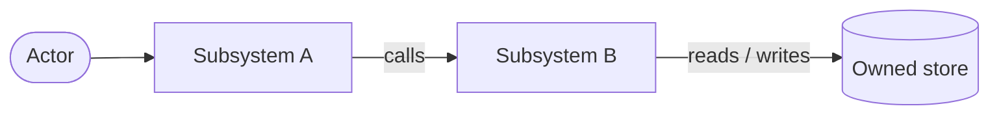
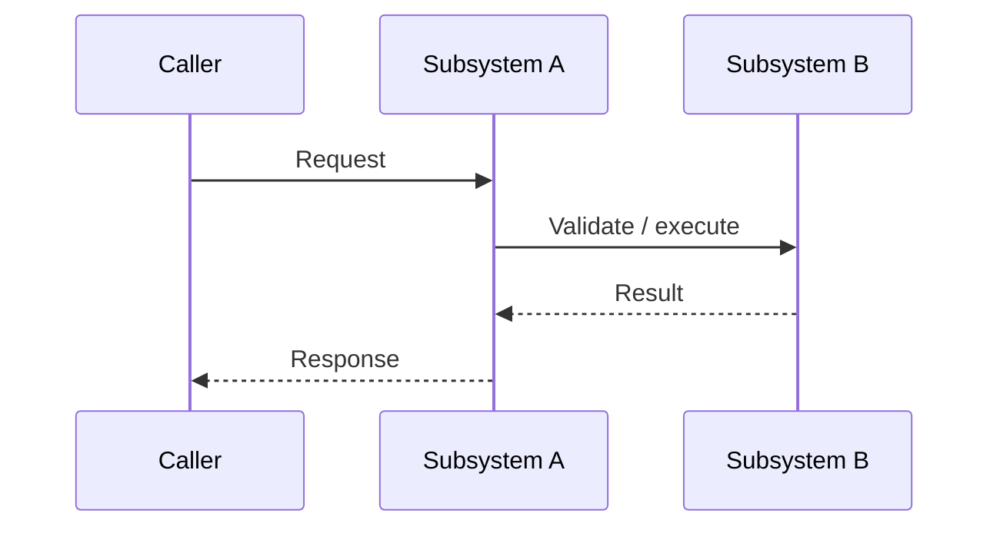

## 1. Context

<!--
Describe only the current state, constraints, and non-functional drivers needed
to understand this design. Reference proposal.md for motivation instead of
repeating it. Name relevant existing specs and code boundaries.
-->

## 2. Goals / Non-Goals

**Goals:**

<!-- Design-level outcomes and qualities this approach must achieve. -->

**Non-Goals:**

<!-- Deliberate boundaries. Do not merely repeat the proposal's scope. -->

## 3. Architecture

<!--
Explain the overall approach and its boundaries. For a cross-cutting change,
include a Mermaid flowchart. Treat the names in the diagram as authoritative:
use the same subsystem names throughout this document.
-->

| Subsystem | Responsibility | Owns (data / contract) |
| --------- | -------------- | ---------------------- |
| <!-- name --> | <!-- one responsibility --> | <!-- explicit ownership --> |

## 4. Components and Runtime Flows

<!--
For each affected component, state its responsibility, inputs, outputs, and
dependencies. Add sequence diagrams for flows whose ordering, state changes,
or failure paths are not obvious. Remove the example if no diagram is useful.
-->

## 5. Data Model

<!--
Describe changed entities and relationships, their canonical logical shapes,
and where they physically live. Name every persistence and serialization format
explicitly. Use an erDiagram when relationships matter. Reference canonical
types or schemas when they already exist instead of duplicating them here.
-->

| Entity / record | Owner | Store and format | Lifecycle / invariants |
| --------------- | ----- | ---------------- | ---------------------- |
| <!-- name --> | <!-- subsystem --> | <!-- table, file, event, memory, etc. --> | <!-- retention, uniqueness, transitions --> |

## 6. Interfaces and Contracts

<!--
Name the protocol and wire format first. Describe only interfaces introduced or
changed by this proposal: HTTP endpoints, RPC methods, CLI commands, events, or
internal boundaries. Reference the data model rather than redefining shapes.
Include validation, errors, idempotency, pagination, and versioning where they
matter. Mark Not applicable with a reason if no interface changes.
-->

| Interface | Purpose | Input | Output / errors | Compatibility |
| --------- | ------- | ----- | --------------- | ------------- |
| <!-- method, event, command, or function boundary --> | <!-- purpose --> | <!-- canonical type --> | <!-- result and failure contract --> | <!-- additive, breaking, versioned --> |

## 7. Security and Trust Boundaries

<!--
Identify trust-boundary crossings and what is authenticated, authorized, and
validated at each one. Cover secrets and sensitive-data handling. Mark Not
applicable with a reason when the change creates no new security implications.
-->

## 8. Failure Modes and Resilience

<!--
For each meaningful dependency or state transition, say what happens when it is
down, slow, duplicated, interrupted, or partially complete. Be explicit about
timeouts, retries, fallback behavior, recovery, and blast radius.
-->

| Failure | Expected behavior | Mitigation / recovery | Blast radius |
| ------- | ----------------- | --------------------- | ------------ |
| <!-- dependency or transition --> | <!-- observable result --> | <!-- timeout, retry, rollback, repair --> | <!-- affected users/data/components --> |

## 9. Decisions, Risks, and Trade-offs

<!--
Give each consequential decision its own subsection. State the decision, why it
wins under the constraints, what it costs, and the alternatives rejected. Avoid
revision history: this document should read as the current settled design.
-->

### Decision: <!-- concise decision title -->

<!-- Decision, rationale, costs, and rejected alternatives. -->

### Risks

<!--
Capture broader design risks not already covered by a concrete failure mode.
Pair each risk with a mitigation: [Risk] → Mitigation.
-->

## 10. Migration and Rollback

<!--
Describe ordering, compatibility windows, data backfills, rollout checks, and a
credible rollback or roll-forward strategy. Mark Not applicable with a reason
for an atomic change that needs no migration.
-->

## 11. Open Questions

<!--
Only questions that can safely be answered later without changing the specs,
chosen approach, or task breakdown. Include an owner or decision trigger. Omit
this section if none remain.
-->
